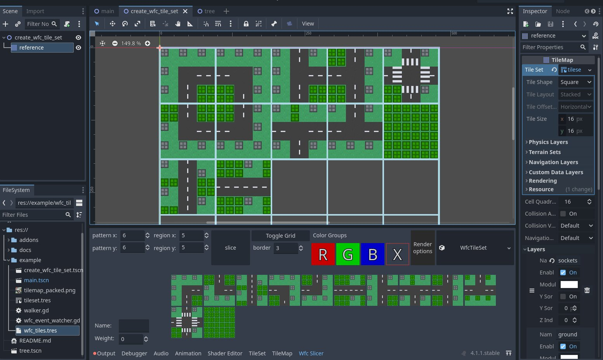
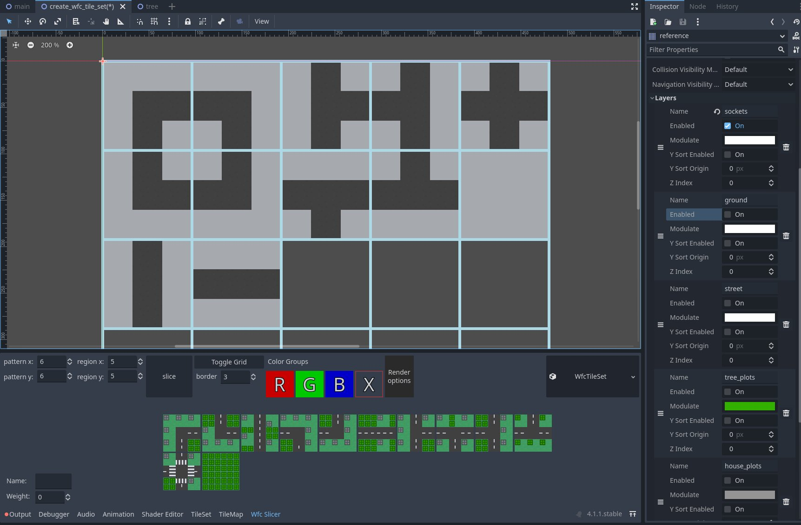
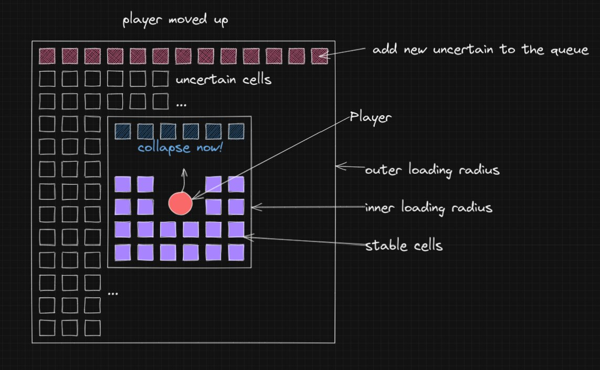

# Infinite Worlds

Godot addon for generating infinite growing worlds using Wave-Function-Collapse algorithm.

[demo.webm](https://github.com/Lommix/infinite_worlds/assets/84206502/b6d2381a-fa34-48ba-8079-87f886f27c6c)

How cool would it be. Draw some tiles, define some simple rules and an infinite world awaits you!

Well this addon makes it possible. It uses the Wave-Function-Collapse algorithm to generate the world.

All you have to do, is draw some patterns on a reference tilemap and use the in-build editor tool to generate a wave function collapse ruleset from that.

Then plug it into a special tilemap node, and you are good to go.

All calculations happen on a different thread! Only the drawing part requires the main thread, which makes this pretty fast.



By using multiple layers, you can define connective rules on the first, and decorative rules on the other layers. All you do is "color code" the first socket layer with tiles from your tileset.
Each Pattern can only connect to other patterns with the same color rules on that particular side.



Here you can see the socket layer, which just consists of 2 different tiles from your tileset. Beware, if you have patterns that cannot connect to any other pattern, the algorithm will fail.

## Installation

To use in your project, just copy the addons/infinite_worlds folder into your project addons folder. Then activate the addon in the project settings.
The rest of this repository is just a demo project, which you can use to play around with.

## Usage

-   Create a new Scene. Add a TileMap node to it.
-   Add a new TileSet to the TileMap node.
-   Start drawing some patterns on the TileMap. Each beeing equal in size.
-   Select the TileMap node and click, open the Wfc Slicer in the bottom panel.
-   Click on `Toggle Grid` to display the grid. Adjust the `pattern x & y` values to match the size of your patterns. `region x & y` determine the amount of patterns in the grid.
-   Once all patterns are in place, click on `slice`. This will generate a ruleset from the patterns you drew.
-   In the `Render Options` you can determine, which layers should later be rendered. For example the first layer, that determines the connectivity of the patterns, can be hidden.
-   You can click on each Pattern and set a `Name` and a `Weight` (default 100). The weight determines the probability of the pattern beeing selected. The higher the weight, the more likely it will be selected.
-   Once you are happy with the ruleset, right click the dropdown menu on the far right, and save the ruleset to a file.
-   In your main scene, add a new `WfcTileMap` node. Add the ruleset you just saved to the `Wfc Tile Set` property.
-   Set a Loading Radius and an Unstable Radius. The Loading Radius determines how many chunks are collapsed around the player. The Unstable Radius should be at least 2 and determines how many new unstable chunks are added around the player.
-   The `Follow Path` is a node, most likely your player, the world is generated around.
-   You can use the color groups to add a group to a pattern. I never used this, but it might be useful for you. You can access this in the signals for example.

## Extend

-   This addons adds some signals, you can subscribe to. For each pattern that is collapsed, a `pattern_collapsed` signal is emitted. You can use this to add some logic to your game. For example, spawn buildings, trees, or enemies. Check out the example project for more details.

```gdscript
## /addons/infinite_worlds/singletons/wfc_map_container.gd

## called on contradiction, a cell has 0 possible outcomes [async]
signal on_contradiction(cell: WfcCell)

## called when drawing to tilemap [mainthread]
signal on_cell_draw(cell: WfcCell)
```

## How the loading works



## Final Words

This is a work in progress/demo addon and not production ready, there are many bugs. I used this to generate the world in my [godot game](https://youtu.be/3B0e7ffAoKQ?t=48), but for reasons (Rust addict) I switched
to the bevy game engine. Would be a shame to let this go to waste, so I decided to share it with you.

I will not add any new features. If you want to contribute, feel free to do so. I'll do my best to help you out.
